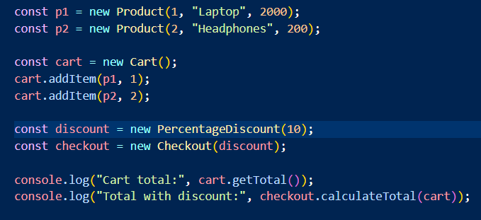

# Lab Work 0: SOLID Principles Implementation

## Author: Madalina Chirpicinic, FAF-233

---

## Objectives:

* Understand and apply the SOLID principles in a simple project;
* Implement 3 SOLID principles (Single Responsibility, Open/Closed, Dependency Inversion);
* Demonstrate proper separation of concerns, flexibility, and maintainability in code.

## Implemented SOLID Principles:

* S – Single Responsibility Principle (SRP)
* O – Open/Closed Principle (OCP)
* D – Dependency Inversion Principle (DIP)

## Implementation

In this project I have implemented an online shopping cart with 2 types of discounts: fixed and percentage discounts. Each class has a single responsibility (SRP), the system can be extended without modifying existing classes (OCP), and high-level modules depend on abstractions rather than concrete implementations (DIP).

* The implementation of the Single Responsibility principle is made using the rule that each class has one clear responsibility. The Product{} class handles the management of products, the CartItem{} class manages the items in a cart by defining the product and quantity, and getting to total of the item cart, the Cart{} class manages the cart by allowing to add items and getting the total as well:

```js
// S: Single Responsibility
// Each class has one clear responsibility
class Product { constructor(id, name, price) { this.id = id; this.name = name; this.price = price; } }
class CartItem { constructor(product, quantity) { this.product = product; this.quantity = quantity; } getTotal() { return this.product.price * this.quantity; } }
class Cart { 
    constructor() { this.items = []; } 
    addItem(product, quantity = 1) { 
        const existing = this.items.find(i => i.product.id === product.id); 
        if (existing) existing.quantity += quantity; 
        else this.items.push(new CartItem(product, quantity)); 
    } 
    getTotal() { return this.items.reduce((sum, i) => sum + i.getTotal(), 0); } 
}
```

* The implementation of the Open / Closed principle is made using the rule that each class is open for extension and closed for modification. As shown in the code, the discount strategy can extend with new discounts and discount types without modifying the Cart:

```js
// O: Open/Closed
// Can extend with new discounts without modifying Cart
class DiscountStrategy { apply(total) { return total; } }
class PercentageDiscount extends DiscountStrategy { constructor(p) { super(); this.p = p; } apply(total) { return total - total * this.p/100; } }
```

* The implementation of the Dependency Inversion principle is made using the rule that each class must depend on abstractions, not on concrete things. Separate modules, that are located on different levels must not depend directly on each other, but should rely on abstractions. As shown in the code, the Checkout{} class depends on abstract DiscountStrategy, not concrete classes:

```js
// D: Dependency Inversion
// Checkout depends on abstract DiscountStrategy, not concrete classes
class Checkout { constructor(discount) { this.discount = discount; } calculateTotal(cart) { return this.discount.apply(cart.getTotal()); } }
```

Below are provided screenshots of how the shopping cart discount system works for different types of discount (fixed discount and percentage discount).

## Case 1: Percentage Discount

**Code:**


**Result:**


---

## Case 2: Fixed Discount

**Code:**


**Result:**


## Conclusions / Results

During this laboratory work, I have successfully applied 3 SOLID principles (S - Single Responsibility Principle, O - Open/Closed Principle, D - Dependency Inversion Principle) in a small project, a system for an online shopping cart with fixed and percentage discounts. Following these code design principles, I have achieved a better code maintainability, extensibility, and clear separation of responsibilities. The resulting project of this laboratory work demonstrates practical understanding of SRP, OCP, and DIP in a simple Javascript context.
